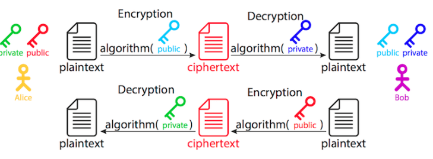

### HTTP Vs. HTTPS Vs. HTTP/2 Vs. SSL Vs. TLS: What’s What?
A lot of acronyms are used to describe the processes of communication between a client and a server. These are often 
mixed up by people who are not familiar with the internals.

The Hypertext Transfer Protocol (HTTP) is the basic communication protocol that both clients and servers must implement 
in order to be able to communicate. It covers things such as requests and responses, sessions, caching, authentication 
and more. The first official version of the protocol (HTTP 1.0) was released in 1996, shortly followed by the currently 
widely adopted version (HTTP 1.1) in 1997.

The protocol transfers information between the browser and the server in clear text, allowing the network, through which 
the information passes, to see the information transmitted. This is a security concern, so HTTP Secure (HTTPS) was introduced, 
allowing the client and the server to first establish an encrypted communication channel, and then pass the clear text 
HTTP messages through it, effectively protecting them from eavesdropping.

The encrypted channel is created using the Transport Layer Security (TLS) protocol, previously called Secure Socket Layer (SSL). 
The terms SSL and TLS are often used interchangeably, with SSL 3.0 being replaced by TLS 1.0. SSL was a Netscape-developed protocol, 
while TLS is an IETF standard. At the time of writing, all versions of SSL (1.0, 2.0, 3.0) are deprecated due to various 
security problems and will produce warnings in current browsers, and the TLS versions (1.0, 1.1, 1.2) are in use, 
with 1.3 currently a draft.

HTTP was used for non-sensitive traffic (for example, reading the news), and HTTPS was used for sensitive traffic 
(for example, authentication and e-commerce); however, increased focus on privacy means that web browsers such as Google 
Chrome now mark HTTP websites as “not private” and will introduce warnings for HTTP in future.

The next upgrade of the HTTP protocol — HTTP/2 — which is being adopted by a growing number of websites, adds new features 
(compression, multiplexing, prioritization) in order to reduce latency and increase performance and security.

In HTTP version 1.1, the secure connection is optional (you may have HTTP and/or HTTPS independent of each other), while 
in HTTP/2 it is practically mandatory — even though the standard defines HTTP/2 with or without TLS, most browser vendors 
have stated that they will only implement support for HTTP/2 over TLS.

### What Does HTTPS Provide?
Why bother with HTTPS in the first place? It is used for three main reasons:

* Confidentiality
    * This protects the communication between two parties from others within a public medium such as the Internet. 
    For example, without HTTPS, someone running a Wi-Fi access point could see private information such as credit cards 
    when someone using the access point purchases something online.
* Integrity
    * This makes sure information reaches its destined party in full and unaltered. 
    For example, our Wi-Fi friend could add extra advertisements to our website, reduce the quality of our images to 
    save bandwidth or change the content of articles we read. HTTPS ensures that the website can’t be modified.
* Authentication
    * This ensures that the website is actually what it claims to be. 
    For example, that same person running the Wi-Fi access point could send browsers to a fake website. 
    HTTPS ensures that a website that says it’s example.com is actually example.com. Some certificates even check the 
    legal identity behind that website, so that you know yourbank.com is YourBank, Inc.

Cryptography In A Nutshell: Confidentiality, integrity and authentication aren’t HTTPS-specific: They’re the core concepts of cryptography. 

##### CONFIDENTIALITY
* Confidentiality is privacy — that is, it protects information from being read by an unauthorized third party. 
The process usually involves turning a readable (i.e. audible and visible) form of the information, called plaintext, 
into a scrambled, unreadable version, called ciphertext. This process is called encryption. 
The reverse process — turning the unreadable ciphertext back into readable plaintext — is called decryption. 
There are many methods — cipher functions (or algorithms) — to encrypt and decrypt information.

* In order for two parties to be able to communicate, they should agree on two things:
    * which algorithm (cipher function) they will use in their communication;
    * which parameters, password or rules (i.e. secret) will be used with the method selected.

* There are two main types of encryption methods:
    * symmetric. Both parties share a common secret key. It is used to encrypt content body. 
    * asymmetric. One of the parties has a pair of a secret and a public key, the foundation of public key infrastructure (PKI).
    It is used to encrypt the shared secret key.
    
The symmetric class of methods relies on both parties having a shared secret, which the sender uses to encrypt the information, 
which in turn the receiver decrypts using the same method and key (see the figure below). The problem with these methods 
is how both parties will negotiate (i.e. exchange) the secret without physically meeting each other — they need to have 
a secure communication channel of some sort.

Symmetric encryption

The asymmetric methods come to solve this kind of problem — they are based on the notion of public and private keys. 
The plaintext is encrypted using one of the keys and can only be decrypted using the other complementary key.

So, how does it work? Let’s assume we have two parties who are willing to communicate with each other securely — Alice 
and Bob (these are always the names of the fictional characters in every tutorial, security manual and the like, 
so we’ll honor the tradition here as well). Both of them have a pair of keys: a private key and a public one. 
Private keys are known only to their respective owner; public keys are available to anyone.

If Alice wants to send a message to Bob, she would obtain his public key, encrypt the plaintext and send him the 
ciphertext. He would then use his own private key to decrypt it.

If Bob would like to send a reply to Alice, he would obtain her public key, encrypt the plaintext and send her 
the ciphertext. She would then use her own private key to decrypt it.
When do we use symmetric and when do we use asymmetric encryption? Asymmetric encryption is used to exchange 
the secret between the client and the server. In real life, we usually do not need two-way asymmetric communication — 
it is sufficient if one of the parties (we’ll just call it a server, for the sake of simplicity) has the set of keys, 
so it can receive an encrypted message. It really protects the security of information in only one direction — from 
the client to the server, because the information encrypted with the public key can only be decrypted using the 
private key; hence, only the server can decrypt it. The other direction is not protected — information encrypted 
with the server’s private key can be decrypted with its public key by anyone. The other party (we’ll similarly 
call it a client) begins the communication by encrypting a randomly generated session secret with the server’s 
public key, then sends the ciphertext back to the server, which, in turn, decrypts it using its own private key, 
now having the secret.

Symmetric encryption is then used to protect the actual data in transit, since it’s much faster than asymmetric 
encryption. The two parties (the client and the server), with the previously exchanged secret, are the only ones 
able to encrypt and decrypt the information.

That’s why the first asymmetric part of the handshake is also known (and referred to) as key exchange and 
why the actual encrypted communication uses algorithms known (and referred to) as cipher methods.

### INTEGRITY
* Another concern, solved with HTTPS, is data integrity: 
    * (1) whether the entire information arrived successfully
    * (2) whether it was modified by someone in transit. 
    
In order to ensure the information is transmitted successfully, message digest algorithms are used. 
Computing message authentication codes (MACs) for each message exchanged are a cryptographic hashing process. 

* For example, obtaining a MAC (sometimes called a tag) uses a method that ensures that it is practically impossible 
(the term commonly used is infeasible) to:
    * change the message without affecting the tag,
    * generate the same tag from two different messages,
    * reverse the process and obtain the original message from the tag.

### AUTHENTICATION
What about authentication? The problem with the real-life application of the public key infrastructure is that both 
parties have no way of knowing who the other party really is — they are physically separate. In order to prove the 
identity of the other party, a mutually trusted third party — a certificate authority (CA) — is involved. 
A CA issues a certificate, stating that the domain name example.com (a unique identifier), is associated with the 
public key XXX. In some cases (with EV and OV certificates — see below), the CA will also check that a particular 
company controls that domain. This information is guaranteed by (i.e. certified by) the certificate authority X, 
and this guarantee is valid no earlier than (i.e. begins on) date Y and no later than (i.e. expires on) date Z. 
All of this information goes into a single document, called an HTTPS certificate. To present an easily understandable 
analogy, it is like a country government (a third party trusted by all) issuing an ID or a passport (a certificate) 
to a person — every party that trusts the government would also accept the identity of the ID holder 
(assuming the ID is not fake, of course, but that’s outside the scope of this example).

Certification authorities (CAs) are organizations trusted to sign certificates. Operating systems, such as Windows, 
macOS, iOS and Android, as well as the Firefox browser, have a list of trusted certificates.

You can check which CAs are trusted by your browser. Also, you can add other unlisted CAs, which is useful when working
with self-signed certificates (which we’ll discuss later).

In most common situations, only the server needs to be known to the client — for example, an e-commerce website to 
its customers — so, only the website needs a certificate. In other situations, such as e-government systems, 
both the server and the client, requesting a service, should have their identity proven. This means that both 
parties should be using certificates to authenticate to the other party. This setup is also outside the scope of this 
article.

### Types Of HTTPS Certificates
There are several types of HTTPS certificates. They can be categorized according to the following criteria.

* IDENTITY VALIDATION
    * Domain validated (DV) The most common type of certificate, a DV certificate verifies that the domain matches a 
    particular public key. The browser establishes a secure connection with the server and displays the closed padlock 
    sign. Clicking the sign will show “This website does not supply ownership information.” There are no special 
    requirements other than having a domain — a DV certificate simply ensures that this is the correct public key 
    for that domain. The browser does not show a legal entity. DV certificates are often cheap (10 USD per year) or 
    free.
    * Extended validation (EV) EV certificates verify the legal organization behind a website. This is the most 
    trustworthy type of certificate, which is obtained after a CA checks the legal entity that controls the domain. 
    The legal entity is checked with a combination of:
        * control of the domain (such as a DV certificate);
        * government business records, to make sure the company is registered and active;
        * independent business directories, such as Dunn and Bradstreet, Salesforce’s connect.data.com, Yellow Pages, etc.;
        * a verification phone call;
        * inspection of all domain names in the certificate (wildcards are explicitly forbidden for EV certificates).
        As well as the closed padlock sign, EV HTTPS certificates display the name of the validated legal e
        ntity — typically a registered company — before the URL. Some devices, such as iOS Safari, will only show 
        the validated legal entity, ignoring the URL completely. Clicking the sign will show details about the 
        organization, such as the name and street address. The cost is between 150 and 300 USD per year.
    * Organization validated (OV) Like EV, OV certificates verify the legal organization behind a website. However, 
    unlike EV, OV HTTPS certificates do not display the verified legal name in the UI. As a result, OV certificates 
    are less popular, because they have high validation requirements, without the benefits of these being shown to 
    users. Prices are in the 40 to 100 USD per year range.

* NUMBER OF DOMAINS COVERED
Once upon a time, HTTPS certificates generally contained a single domain in the CN field. Later, 
the “subject alternative name” (SAN) field was added to allow additional domains to be covered by a single certificate.
These days, all HTTPS certificates are created equal: Even a single-domain certificate will have a SAN for that 
single domain (and a second SAN for the www version of that domain). However, many certificate vendors still 
sell single- and multi-domain HTTPS certificates for historical reasons.

* Single domain This is the most common type of certificate, valid for the domain names example.com and www.example.com.
* Multiple domains (UCC/SAN) This type of certificate, also known as Unified Communications Certificate (UCC) or 
Subject Alternative Names (SAN) certificate, can cover a list of domains (up to a certain limit). It is not limited 
to a single domain — you can mix different domains and subdomains. The price usually includes a set number of 
domains (three to five), with the option to include more (up to the limit) for an additional fee. Using it with related 
websites is advised, because the client inspecting the certificate of any of the websites will see the main domain, 
as well as all additional ones.
* Wildcard This type of certificate covers the main domain as well as an unlimited number of 
subdomains (*.example.com) — for example, example.com, www.example.com, mail.example.com, ftp.example.com, etc. 
The limitation is that it covers only subdomains of the main domain.

  
  
###  The Configuration
To recap, four components of HTTPS require encryption:

* The initial key exchange This uses asymmetric (private and public key) algorithms.
* The identity certification (the HTTPS certificate, issued by a certification authority) This uses asymmetric (private and public key) algorithms.
* The actual message encryption This uses symmetric (pre-shared secret) algorithms.
* The message digesting This uses cryptographic hashing algorithms.

Each of these components has a set of used algorithms (some of them deprecated already) that use different key sizes. 
Part of the handshake involves the client and the server agreeing on which combination of methods they will 
use — select one out of about a dozen public key (key exchange) algorithms, one out of about a dozen symmetric 
key (cipher) algorithms and one out of three (two deprecated) message-digesting (hashing) algorithms, which gives 
us hundreds of combinations.

For example, the setting `ECDHE-RSA-AES256-GCM-SHA384` means that the key will be exchanged using the `Elliptic Curve 
Diffie-Hellman Ephemeral (ECDHE)` key exchange algorithm; the CA signed the certificate using 
the `Rivest-Shamir-Adleman (RSA)` algorithm; the symmetric message encryption will use 
the `Advanced Encryption Standard (AES)` cipher, with a `256-bit` key and `GCM` mode of operation; 
and message integrity will be verified using the `SHA` secure hashing algorithm, using `384-bit` digests. 
(A comprehensive list of algorithm combinations is available.)

So, there are some configuration choices to be made.

##### CIPHER SUITES
Deciding the cipher suites to use is a balance between compatibility and security:

* Compatibility with older browsers needs the server to support older cipher suites.
* However, many older cipher suites are no longer considered secure.

OpenSSL lists the supported combinations (see above) in order of cryptographic strength, with the most secure at 
the top and the weakest at the bottom. It is designed in this way because, during the initial handshake between 
the client and the server, the combination to be used is negotiated until a match is found that is supported by 
both parties. It makes sense to first try the most secure combinations and gradually resort to weaker security 
only if there is no other way.

A very useful and highly recommended resource, advising on what cryptographic methods to enable on the server, 
is the Mozilla SSL Configuration Generator, which we’ll use later on with actual server configurations.

##### KEY TYPES
`Elliptic Curve Cryptography (ECC)` certificates are faster and use less CPU than the RSA certificates, 
which is particularly important for mobile clients. However, some services, such as Amazon, CloudFront and Heroku, 
don’t yet, at the time of writing, support ECC certificates.

A 256-bit ECC key is considered sufficient.

Rivest Shamir Adleman (RSA) certificates are slower but compatible with a wider variety of older servers. 
RSA keys are larger, so a 2048-bit RSA key is considered minimal. 
RSA certificates of 4096 and above may hurt performance — they’re also likely to be signed by a 2048-bit intermediary, 
undermining much of the additional security!

You might have noticed the fluidity of the statements above and the lack of any numbers — it is because what is a 
heavy load on one server is not on another. The best way to determine the impact on performance is to monitor the 
load on your server, with your real website(s) and your real visitors. And even that will change over time.

##### Procedures
To obtain an HTTPS certificate, perform the following steps:

* Create a private and public key pair, and prepare a Certificate Signing Request (CSR), including information 
about the organization and the public key.
* Contact a certification authority and request an HTTPS certificate, based on the CSR.
* Obtain the signed HTTPS certificate and install it on your web server.

There exists a set of files, containing different components of the public key infrastructure (PKI): the private and 
public keys, the CSR and the signed HTTPS certificate. To make things even more complicated, different parties use 
different names (and file extensions) to identify one and the same thing.

To start, there are two popular formats for storing the information — DER and PEM. The first one (DER) is binary, 
and the second (PEM) is a base64-encoded (text) DER file. By default, Windows uses the DER format directly, 
and the open-source world (Linux and UNIX) uses the PEM-format. There are tools (OpenSSL) to convert between one 
and the other.

* The files we’ll be using as examples in the process are the following:
    * example.com.key This PEM-formatted file contains the private key. The extension .key is not a standard, 
    so some might use it and others might not. It is to be protected and accessible only by the system super-user.
    * example.com.pub This PEM-formatted file contains the public key. You do not actually need this 
    file (and it’s never explicitly present), because it can be generated from the private key. It is only 
    included here for illustration purposes.
    * example.com.csr This is a certificate signing request. A PEM-formatted file containing organizational 
    information, as well as the server’s public key, should be sent to the certification authority issuing 
    the HTTPS certificate.
    * example.com.crt This HTTPS certificate is signed by the certification authority. It is a PEM-formatted file, 
    including the server’s public key, organizational information, the CA signature, validity and expiry dates, etc. 
    The extension .crt is not a standard; other common extensions include .cert and .cer.

File names (and extensions) are not standard; they can be anything you like. I have chosen this naming convention 
because I think it is illustrative and makes more obvious which component has what function. You can use whatever 
naming convention makes sense to you, as long as you refer to the appropriate key-certificate files in the commands 
and server configuration files throughout the process.

The private key is a randomly generated string of a certain length (we’ll use 2048-bit). Keep the private key private! 
This means protect it by very restricted permissions (600), and do not disclose it to anyone.

The Certificate Signing Request (CSR) contains the server's public key and details about the organization ACME Inc., 
based in London, UK, and which owns the domain name example.com.

Finally, the signed HTTPS certificate looks like the following:
This particular CSR contains the server's public key and details about the organization ACME Inc., 
based in London, UK, and which owns the domain name example.com.

## Step 1: Create A Private Key And A Certificate Signing Request (CSR)
## Step 2: Obtaining The HTTPS Certificate
In order to get your website certificate, first purchase a HTTPS certificate credit of a chosen 
type (DV, OV, EV, single site, multisite, wildcard — see above) from an HTTPS certificate provider. 
Once the process is complete, you will have to provide the certificate signing request, which will spend the 
purchased credit for your chosen domain. You’ll be asked to provide (i.e. to paste in a field or to upload) 
the whole CSR text, including the `—–BEGIN CERTIFICATE REQUEST—– and —–END CERTIFICATE REQUEST—–` lines. 
If you would like to have an EV or OV certificate, you’ll need to provide the legal entity for which you’re 
requesting the certificate — you might also be asked to provide additional documents to confirm that you represent 
this company. The certificate registrar will then verify your request (and any supporting documents) and issue the 
signed HTTPS certificate.

### GETTING AN HTTPS CERTIFICATE
Your hosting provider or HTTPS registrar might have a different product and registration procedure, 
but the general logic should be similar.

* Find an HTTPS certificate vendor.
* Select a type of certificate (DV, OV, EV, single site, multisite, wildcard), and click “Add to cart.” Specify 
your preferred payment method and complete the payment.
* Activate the new HTTPS certificate for your domain. You can either paste or upload the certificate signing 
request. The system will extract the certificate details from the CSR.
* You will be asked to select a method of “Domain Control Validation” — whether by email, uploading an 
HTML file (HTTP-based) or adding a TXT record to your domain zone file (DNS-based). Follow the instructions 
for your DCV method of choice to validate.
* Wait several minutes until the validation is performed and the HTTPS certificate is issued. Download the 
signed HTTPS certificate.

### SELF-SIGNED CERTIFICATES
It is also possible to sign a certificate yourself, rather than have a certificate authority do it. 
This is good for testing purposes because it will be cryptographically as good as any other certificate, 
but it will not be trusted by browsers, which will fire a security warning — you can claim you are anything you want,
but it wouldn’t be verified by a trusted third party. If the user trusts the website, they could add an exception 
in their browser, which would store the certificate and trust it for future visits.

The example certificate above is a self-signed one — you can use it for the domain example.com, 
and it will work within its validity period.

You can create a self-signed certificate on any platform that has OpenSSL available:

``openssl x509 -signkey example.com.key -in example.com.csr -req -days 365 -out example.com.crt``

Once the certificate is available, you will have to install it on your server. If you are using hosting and HTTPS 
registration services from the same provider (many hosting providers also sell HTTPS certificates), there might 
be an automated procedure to install and enable your newly obtained HTTPS certificate for the website. 
If you are hosting your website elsewhere, you will need to download the certificate and configure your server 
to use it.