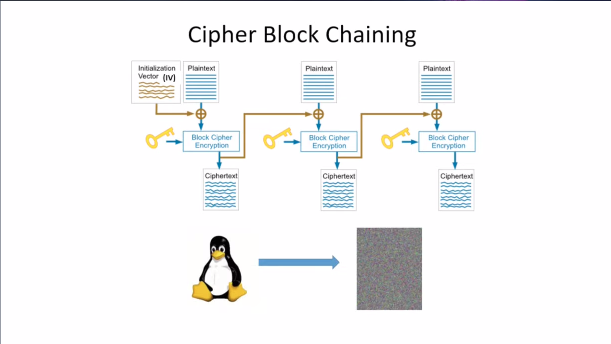

# Java Cryptography

### Contents
1. [Introduction-What does cryptography solve](#1-introduction-what-cryptography-solves)
2. [Hashing](#2-hashing)
3. [Symmetric Encryption](#3-symmetric-encryption) 
4. [Asymmetric Encryption](#4-asymmetric-encryption)
5. [Digital Signatures](#5-digital-signatures)
6. [Certificates](#6-certificates)


### 1. Introduction-What does cryptography solve?

* Confidentiality (encryption): message should be encrypted
* Integrity (digital signatures): message should not be changed
* Authenticity (certificate): receiver should be the right one

* Contemporary Cryptography
    * Symmetric encryption
    * Asymmetric encryption
    


* Java Cryptography
    * JCA (Java Cryptography Architecture)
    * JCE (Java Cryptography Extension)
    

* How to plug in a security provider
    * First way:
        ```
        Security.addProvider(new SpecificProvider()); // extends java.security.Provider
        ```
    * Second way: edit java.security file

* JCA/JCE API Summary:    
    


**[⬆ Back to top](#Contents)**

### 2. Hashing
* Properties:
    * one-way
    * deterministic
    * fixed-size
    * psuedo random
    
* Hashing algorithm
    * 

* Application: Password hashing
    * Rainbow table(pre-hashing for regular words) may crack the password.
    
    * One solution is to use random salt
    

### 3. Symmetric Encryption
* Symmetric encryption
    

* Example
    

* Algorithms
    
* Implementation in Java
    

* Electronic CopyBook Encryption(ECB)
    
    
* Cipher Block Chaining
    


* Symmetric encryption with IV in Java
    


* How to exchange symmetric encryption key in public channel
    


### 4. Asymmetric Encryption
* Asymmetric encryption
    

* Asymmetric encryption algorithm
    

* Asymmetric encryption in Java
    

* Asymmetric encryption limitation
    


### 5. Digital Signatures
* Digital Signatures
    
* HMAC signing
    
    
* DS using asymmetric encryption
    

* DS in Java
    

* DS application
    


### 6. Certificates
It is used for authenticity.

* How does this work?
    

* Create a certificate in Java
    
  
    
    
* HTTPS   
    
    